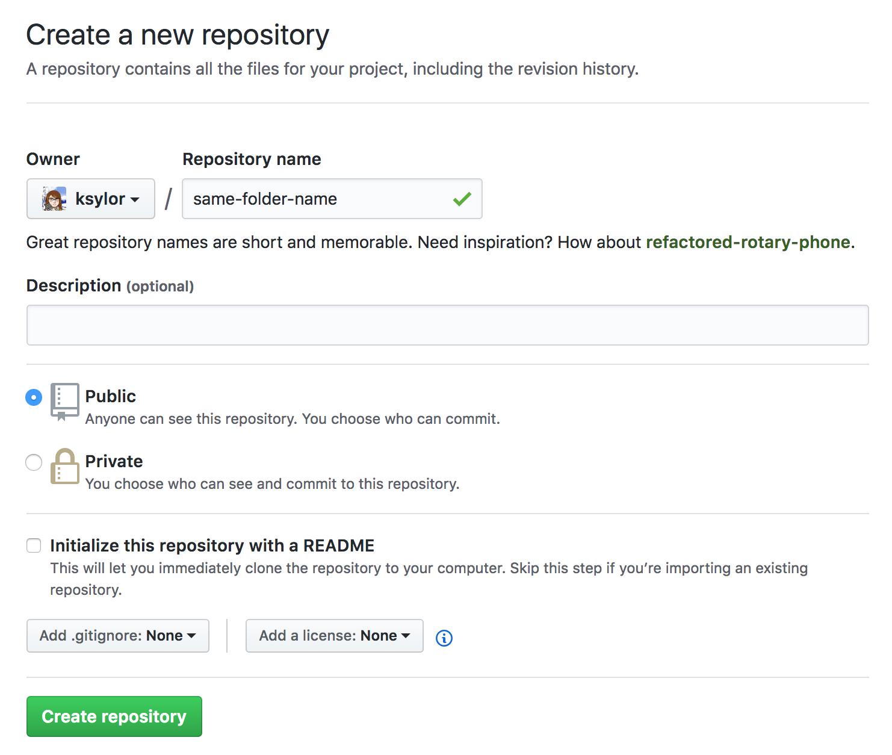

# Creating and Cloning Repos
Let's get started by cloning and creating git repos to get comfortable working with repos and remotes.

## Prework
Let's make sure that you have git installed on your laptop.

1. Pop open your favorite terminal or command line program 
-- in Mac the default is usually in the Finder under Applications -> Utilities -> Terminal. 
-- in Windows the default is usually in the Start Menu -> Command Prompt. Or, you can open the Start Menu and type `cmd` into the Search bar (or Run, depending on what version of windows), then hit enter.

2. Type in the command `git --version`

3. Confirm that `git version x.x.x` is output. Ideally we want a version 2.x variant, if you have a 1.x version, let me know!.

Also make sure that you have a Github.com account!

## Create a new repo
Next, let's go through the steps to create a new repo in the command line, then push that repo up to Github.

1. Create a new folder on your laptop to store your new design system files, call it whatever you want, but use dashes or underscores instead of spaces. Create some placeholder files in the new folder, they can be just empty text files and named whatever you'd like. 

2. Copy the path to the new folder that you created (lmk if you need help figuring that out!). 

3. Pop open your favorite terminal or command line program and move into your new folder with the command `cd path/to/folder`

4. Confirm that you are in the correct folder using the command `pwd` on a mac or `cd` (no arguments) on windows. Then confirm that you have some files in there using the `ls` command on mac or `dir` on windows.

5. Initialize a new repository using the command `git init`. You should see the the output:

```
Initialized empty Git repository in /path/to/folder/.git/
```

6. Run the command `git add .` to add the new files to staging (we'll go over this in more detail later today).

7. Create the first commit in your repository using the command `git commit -m "Your text here"`. You should see output similar to this but with your file names:

```
[master (root-commit) 50e92cc] initial commit, hooray
 3 files changed, 0 insertions(+), 0 deletions(-)
 create mode 100644 fun.txt
 create mode 100644 more-fun.txt
 create mode 100644 the-most-fun.txt
 ```

**Congratulations! You made a git repo!**

## Push your new repo to Github

1. Log in and navigate to your Github profile page `https://github.com/<username>`

2. Click the plus icon in the upper right corner, in the dropdown choose "New Repository"

3. In the form that opens, enter the project name - for your future sanity, use the same folder name that you created above.

4. Leave everything else as-is - don't create a README or add gitignore or license files, and click the "Create Repository" button. 



5. In the next page, copy the url from the section labeled "Quick Setup".


6. Open up the command line again, and run the command `git remote add origin <url you copied>` the url should look something like `https://github.com/<username>/<reponame>.git`. This will set the remote repo that you just created as the remote repo named `origin`.

7. Run the command `git remote -v` to confirm that the remote is set up correctly. You should see the url repeated twice.

8. Now push up your new repo's contents by running `git push -u origin master` this will set the `master` branch in the remote repository named `origin` as the upstream tracking branch for your local master. We'll dig into what this means later in the day! You should see output similar to this:

```
Counting objects: 3, done.
Delta compression using up to 8 threads.
Compressing objects: 100% (2/2), done.
Writing objects: 100% (3/3), 245 bytes | 245.00 KiB/s, done.
Total 3 (delta 0), reused 0 (delta 0)
remote:
remote: Create a pull request for 'master' on GitHub by visiting:
remote:      https://github.com/ksylor/clarity-workshop-example/pull/new/master
remote:
To https://github.com/ksylor/clarity-workshop-example.git
 * [new branch]      master -> master
Branch master set up to track remote branch master from origin.
```

9. Head back to your repo's github page and refresh to confirm that your pushed changes are there.

**Congratulations! You shared your git repo with the world!**

_Bonus extra work:_ 
1. Add a README.md file to your repo to describe it's purpose.
2. Go and explore the different tabs in the repo homepage on Github (e.g. visit the Code, Issues, Pull Requests, Projects, Wiki, etc. tabs)

## Clone the example repo

Let's practice copying a remote repository to your local machine.

1. In the command line, run `cd ..` to move up one level and out of the repo you just created.

2. Go to the example repo's homepage at https://github.com/ksylor/clarity-workshop-example

3. Click the green "Clone or Download" button. In the dropdown, click the icon to copy the https clone URL.


4. In the command line, run `git clone <copied url>`. You should see the output:

```
Cloning into 'clarity-workshop-example'...
remote: Enumerating objects: 7, done.
remote: Counting objects: 100% (7/7), done.
remote: Compressing objects: 100% (5/5), done.
remote: Total 7 (delta 0), reused 0 (delta 0), pack-reused 0
Unpacking objects: 100% (7/7), done.
```

5. Run the command `cd clarity-workshop-example` to move into the new folder that git created. 

6. Run the command `git remote -v` to confirm that the remote is set up correctly as `origin`. You should see the url repeated twice.

7. Run the command `ls` in Mac or `dir` in windows to list out the directory contents.

**Congratulations! You cloned a remote repo!**
