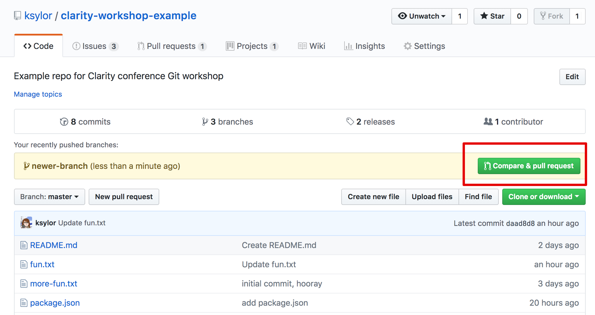
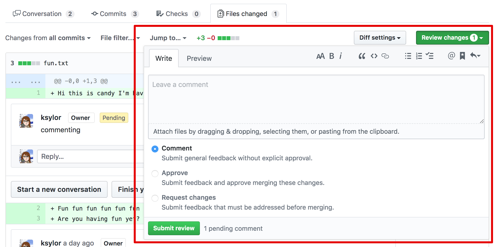

# Feature Branches and PRs

Let's try out a workflow that will be much closer to what you'll do in a real life situation

## Create a PR

1. In your example repo terminal, check out the new branch we created in exercise #2. If you can't remember what it was called, you can run `git branch` with no arguments to see a list of all your branches with the currently checked out branch highlighted with an asterisk.

```
feature-branch
* master
```

2. If you've followed along with the exercises, this branch should be a few commits behind master, and should have a unique commit of it's own. If you aren't sure, you can make a change to any file and commit that. 

_Extra bonus work:_ If you want to do some fun advanced stuff to check if your feature branch has commits that are not in master, run the following command `git log "$(git merge-base <branch name> master)"..HEAD` (replace `<branch name>` with the correct branch name). If there is no output from this command, then you need to make a new commit. (This is a pretty advanced command, can you guess what it might be doing?)

3. Run `git push -u` to push your feature branch up to the remote origin (aka Github.com) and set up that branch as your remote tracking branch

4. Go to your repo's homepage in Github.com (refresh the page if you already have it open). Git should show you a yellow alert bar that asks if you want to create a new pull request with the branch you just pushed. Click the "Compare and pull request" button to create a new PR.



5. Enter a title and a description for your PR and click the "Create pull request" button. 

**Congratulations your made your first PR!**

## Comment on your PR

1. In the landing page for your PR, click on the "Files changed" tab.

2. In one of the files you changed, hover just to the right of the line number to bring up the plus icon button. Click on that to open up the comment box. 

3. Enter a comment into the field, then click "Start a review" so we can practice grouping comments into a single review. The "Review changes" button in the upper right should now have a badge with the number 1.

4. Add another comment to a different line or a different file. (If you only have one line to comment on, that's okay!, practice adding a follow-up comment). Click "Add review comment" if applicable, the "Review changes" badge should go up by one.

5. Click the "Review changes" button to finalize your review. 



Since you are the owner of the PR, you can only choose "Comment" as your review type, but take a look at the other options to get familiar with them. Add an overall comment into the box if you'd like, then click "Submit review" to make your comments. 

Note that you can perform any actions in the "Submit review" button without having to comment on a line of the code! 

## Merge your branch into master

Let's pretend that your PR was approved, great work! Now let's get those changes into master.

1. Go back into the main "Conversation" view for your PR and click the dropdown arrow on the big green "Merge Pull Request" button to merge your PR! Make sure you select one of our preferred methods (aka anything but a merge commit). 

**If the github UI is telling you that you have a merge conflict and can't commit, let me know and we'll go over that process together!**

2. Open up your terminal and pull down the latest version of `master` with your branch merged in.

_Extra bonus work:_ Delete your feature branch in both the PR UI and from your local install (tip: `git branch -D <branchname>`)

**Congratulations! You're ready to handle some real life git workflows!**
